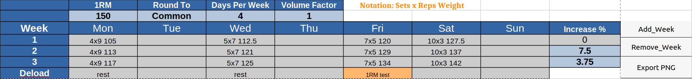

# Agade's Smolov
The smolov base cycle is a popular high-frequency training routine mainly used for squats and bench press. It is often referred to as "smolov Jr". This is my adaptation of it.

[Spreadsheet Download Link](https://github.com/Agade09/Agade-s-Smolov/raw/master/Agade_Smolov.ods)

## Differences

### Inconsistent relative intensity

The smolov base cycle suggests adding 10kg in week 2 and another 5kg in week 3. The problem is that this adds the same amount of weight to days 1 and 4.
If we look at the percentages chosen for week 1 of the smolov base cycle: 70%/75%/80%/85% for sets of 9/7/5/3. One can see, using a [RM calculator](https://exrx.net/Calculators/OneRepMax) that those percentages are chosen such that relative intensity is constant across the week. However, when we add a constant 10kg to both 70% and 85% in week 2, we are no longer maintaining a constant relative intensity across the week.

Example: 100kg 1RM
 Week | D1 9 reps | D4 3 reps | D1 [Calculated relative intensity](https://exrx.net/Calculators/OneRepMax) | D4 [Calculated relative intensity](https://exrx.net/Calculators/OneRepMax)  | D4/D1 Ratio
 ---- |----| ---| ------------                                                      | ------------                                                                     | ----
   1  | 70 | 85 | 90                                                                | 90                                                                               | 1.214
   2  | 80 | 95 | 103                                                               | 101                                                                              | 1.187
   3  | 85 | 100 | 109                                                              | 106                                                                              | 1.176

We can fix this by, for example, lifting 70/75/80/85 percent of (1RM + 12kg) instead of lifting (70/75/80/85% 1RM) +10kg.

TLDR: I believe the author of smolov intended for relative intensity to be constant across the week but it is slightly not in weeks 2/3. As compared to the smolov base cycle, Agade's smolov has a slightly lighter early week for weeks 2/3.

### Weight addition

The smolov base cycle recommends adding 10kg in week 2 and another 5kg in week 3. I believe this recommendation is made for the average male with, let's say a 150kg squat.
But does it make any sense for a, e.g. small female lifter, with a 60kg squat to add 10kg from one week to the next? That is relatively a 2.5 times bigger jump than for the 150kg squatting male.
I hypothesise that the weekly increment should be proportional to the previous week's weight. The increase percentage chosen in the spreadsheet is such that it will approximately give the 10kg and 5kg increases of the smolov base cycle in the case of a ~150kg 1RM.

### Squat every day

If you are willing and able, you can optionally have a 7 day version of the program which spreads out the volume across the week. This makes the volume a bit more manageable and the increased frequency may be beneficial to your progress.

## Conveniences

### Adding weeks

If your program is going very well, the spreadsheet includes buttons to add an extra week.

### Weights rounding

Several weight-rounding options are available from a drop-down menu. The default "Common" option assumes you have IWF-style kg change plates (0.5,1,1.5,2,2.5) and 1.25 plates. The other options will round the weights to the specified number. For example, lbs users may want to round to the nearest 2.5 because 1.25 seems to be the smallest lb plate commonly available.

### Export PNG button

A button allows exporting of the program to an image.

## Suggestions

### 1RM Test
Test your newly found strength with an AMRAP of your last week's day 2 (sets of 7) weight for example. The smolov base cycle has you high-volume training in the "basic strength" region and you may find your "limit strength" (90%+ 1RM) to be lagging behind. Test yourself on higher reps and use a calculator to estimate your new 1RM which you can potentially use for another cycle.
